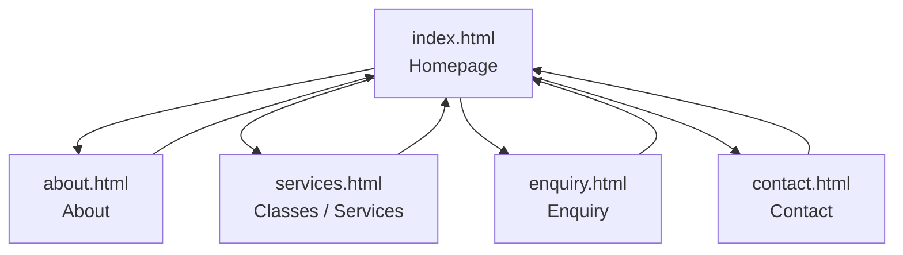

# MetroGym Website

WEDE5020 (Web Development — Introduction) — Portfolio of Evidence

## Student Information

- **Name:** Phawu Zotwa (Lezo)
- **Institution:** Rosebank International (IIE)
- **Module:** WEDE5020 — Web Development (Introduction)
- **Assessment:** Portfolio of Evidence (PoE)

## Project Overview

MetroGym is a functional fitness and CrossFit-style training gym located on Cape Road, Gqeberha, founded in 2016 by Asavela Kahla. This repository contains the source code for MetroGym's first official website, built as the practical component of the WEDE5020 Portfolio of Evidence. The site is being developed across three parts:

- **Part 1 — Building the Foundation:** project planning, research, and initial HTML structure. *(current stage)*
- **Part 2 — Designing the Visuals:** CSS styling and responsive design. *(to follow)*
- **Part 3 — Adding Functionality and SEO:** JavaScript interactivity and SEO optimisation. *(to follow)*

## Website Goals and Objectives

- Increase the number of free trial class bookings generated online.
- Provide an informative, always-available source for class schedules, pricing, and location, reducing repetitive phone/walk-in enquiries.
- Build community credibility through consistent, professional branding.

**Key Performance Indicators (KPIs):**
- Number of trial-class bookings submitted via the enquiry form per month.
- Number of unique visitors to the services/schedule page.
- Enquiry form completion rate.

## Key Features and Functionality

- Responsive, mobile-first layout with a sticky navigation header.
- Homepage hero section with a clear call-to-action to book a free trial.
- About page detailing MetroGym's history, mission, and founder.
- Services page listing class types and the weekly class schedule.
- Enquiry page with a form for trial bookings and general questions.
- Contact page with address, hours, and contact details.
- Consistent industrial visual identity (charcoal, concrete, chalk, hot-orange) using 'Bebas Neue' and 'Inter' typefaces.

## Timeline and Milestones

| Milestone | Part | Status |
|---|---|---|
| Organisation research, sitemap, initial HTML structure | Part 1 | ✅ Complete |
| CSS styling and responsive design | Part 2 | ⏳ Planned |
| JavaScript functionality and SEO optimisation | Part 3 | ⏳ Planned |

## Part 1 Details

Part 1 covers project initiation and planning:

- Selected MetroGym as the target organisation (approved fictional small business).
- Completed the Website Project Proposal (see `WEDE5020_Website_Project_Proposal.docx`, submitted separately), including a second proposal option for comparison.
- Conducted content research for each page (organisation history, class offerings, contact details).
- Set up the file and folder structure (root HTML files, `css`, `js`, and `images` folders).
- Built the initial HTML structure for all 5 required pages using semantic tags (`header`, `nav`, `main`, `footer`), with descriptive comments and consistent indentation.
- Set up navigation links functioning correctly across all pages.
- Created and pushed the initial commits to this GitHub repository.

*(Part 2 and Part 3 details will be added here in future submissions/edits.)*

## Sitemap



**Page hierarchy:**
- **Home** (`index.html`) — top-level entry point, linked from every page.
  - **About** (`about.html`)
  - **Services** (`services.html`) — class types and weekly schedule.
  - **Enquiry** (`enquiry.html`) — trial booking / enquiry form.
  - **Contact** (`contact.html`)

## File and Folder Structure

```
metrogym/
├── index.html
├── about.html
├── services.html
├── enquiry.html
├── contact.html
├── css/
│   └── style.css
├── js/
│   └── script.js      (placeholder — populated in Part 3)
└── images/             (placeholder — populated in Part 2/3)
```

## Changelog

- **14 August 2026** — Part 1: Restructured `classes.html` to `services.html` to match the required site structure. Added semantic `<main>` sectioning and descriptive comments to all pages. Added `js/` and `images/` folders. Wrote the Website Project Proposal (two organisation options). Wrote this README.
- **11 August 2026** — Initial HTML pages created (`index.html`, `about.html`, `contact.html`, `enquiry.html`, `classes.html`) and pushed to GitHub with a shared `css/style.css`.

## References

- Google Fonts (2026) *Bebas Neue* and *Inter* [font families]. Available at: https://fonts.google.com (Accessed: 14 August 2026).
- Mozilla Developer Network (2026) *HTML: HyperText Markup Language*. Available at: https://developer.mozilla.org/en-US/docs/Web/HTML (Accessed: 14 August 2026).
- Mozilla Developer Network (2026) *CSS: Cascading Style Sheets*. Available at: https://developer.mozilla.org/en-US/docs/Web/CSS (Accessed: 14 August 2026).
- W3Schools (2026) *HTML Forms*. Available at: https://www.w3schools.com/html/html_forms.asp (Accessed: 14 August 2026).
